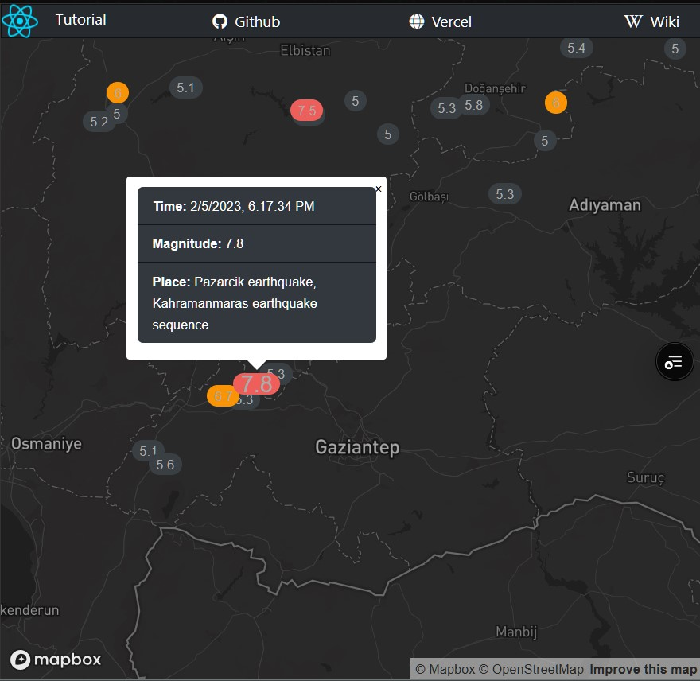

# Earthquakes (Kahramanmaras February, 05-06, 2023)
> mapbox tutorial to fetch earthquakes json data

| desc | link |
|-- | -- |
|see live on vercel | [link1] |
|code repo github   | [link2] |
|mapbox tutorial    | [link3] |

[link1]:https://dynamic-markers-jsx.vercel.app/
[link2]:https://github.com/attila5287/dynamic-markers-jsx
[link3]:https://docs.mapbox.com/help/tutorials/dynamic-markers-react/?step=1

